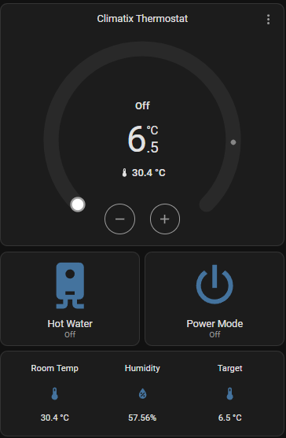

# Siemens Climatix IC (RDS110) for Home Assistant

[](https://github.com/hacs/default)
[](https://github.com/andreasc1/homeassistant-climatix-ic/releases)
[](https://www.home-assistant.io/)
[](https://opensource.org/licenses/MIT)

A custom Home Assistant integration for the **Siemens RDS110 Smart Thermostat**, controlled through the Siemens Climatix IC cloud platform. It signs in with your Climatix IC account, automatically discovers every thermostat on it, and exposes full climate control, switches, and sensors — no device IDs or datapoint addresses to configure by hand.

> **Requires Home Assistant 2024.4 or newer.**

---

## ✨ Features

- **Climate entity** (`climate.climatix_thermostat`)
  - Target setpoint control, with the valid min/max range read live from the device (typically 6.5–35 °C).
  - HVAC mode switching between **Heat** (Comfort mode) and **Off** (Protection mode), plus turn-on / turn-off.
  - Live room temperature and relative humidity.
- **Switches**
  - **Hot Water Heater** – independent control (handles the device's inverted on/off logic).
  - **Space Heating** – independent relay control.
  - **Thermostat Power** – toggle between Comfort and standby Protection mode.
- **Sensors** – room temperature, relative humidity, target setpoint, setpoint offset, and raw operating mode.
- **Automatic discovery** – each RDS thermostat on your account is discovered and exposed as its own Home Assistant **device**; no plant IDs, user IDs, or datapoint addresses are hardcoded.
- **Robust cloud handling** – transparent OAuth token renewal, and a re-authentication prompt if your stored password stops working.

See the [release notes](https://github.com/andreasc1/homeassistant-climatix-ic/releases) for what changed in each version.

---

## 📊 Exposed Entities

For a single-thermostat account the entities are:

| Entity ID | Name | Type | Description |
| :--- | :--- | :--- | :--- |
| `climate.climatix_thermostat` | Climatix Thermostat | Climate | Setpoint and HVAC mode control |
| `switch.climatix_thermostat_power` | Climatix Thermostat Power | Switch | Comfort (on) vs. Protection (off) |
| `switch.climatix_hot_water_heater` | Climatix Hot Water Heater | Switch | Hot water relay (inverted logic) |
| `switch.climatix_space_heating` | Climatix Space Heating | Switch | Space heating relay |
| `sensor.climatix_room_temperature` | Climatix Room Temperature | Sensor | Current ambient temperature (°C) |
| `sensor.climatix_target_setpoint` | Climatix Target Setpoint | Sensor | Current target setpoint (°C) |
| `sensor.climatix_relative_humidity` | Climatix Relative Humidity | Sensor | Current relative humidity (%) |
| `sensor.climatix_setpoint_offset` | Climatix Setpoint Offset | Sensor | Setpoint offset (°C) |
| `sensor.climatix_operating_mode` | Climatix Operating Mode | Sensor | Raw operating mode (`3` = Comfort, `1` = Off) |

> If your account has more than one thermostat, each becomes a separate device with its own set of entities, and Home Assistant appends a numeric suffix to disambiguate the entity IDs.

---

## 🛠️ Installation

### Method 1 — HACS (recommended)

1. Open **HACS** in the Home Assistant sidebar.
2. Click the three-dots menu **`⋮`** (top right) → **Custom repositories**.
3. Add `https://github.com/andreasc1/homeassistant-climatix-ic` with category **Integration**.
4. Open the **Siemens Climatix IC** card and click **Download**.
5. **Restart Home Assistant.**

### Method 2 — Manual

1. Download the latest archive from the [Releases](https://github.com/andreasc1/homeassistant-climatix-ic/releases) page.
2. Copy the `climatix_ic` folder into `/config/custom_components/`.
3. **Restart Home Assistant.**

---

## ⚙️ Configuration

1. Go to **Settings → Devices & Services**.
2. Click **Add Integration** (bottom right).
3. Search for **Siemens Climatix IC RDS110**.
4. Enter your Climatix IC **email address** and **password**, then **Submit**.

The integration polls the Siemens cloud every 60 seconds. If your password later changes, Home Assistant will prompt you to re-authenticate — no need to delete and re-add.

---

## 🎨 Recommended Dashboard Card



Add this compact control card via **Edit Dashboard → Add Card → Manual**:

```yaml
type: grid
columns: 1
square: false
cards:
  - type: thermostat
    entity: climate.climatix_thermostat

  - type: grid
    columns: 2
    square: false
    cards:
      - type: button
        entity: switch.climatix_hot_water_heater
        name: Hot Water
        icon: mdi:water-boiler
        show_state: true
        tap_action:
          action: toggle

      - type: button
        entity: switch.climatix_thermostat_power
        name: Power Mode
        icon: mdi:power
        show_state: true
        tap_action:
          action: toggle

  - type: glance
    entities:
      - entity: sensor.climatix_room_temperature
        name: Room Temp
      - entity: sensor.climatix_relative_humidity
        name: Humidity
      - entity: sensor.climatix_target_setpoint
        name: Target
```

---

## 🔍 How It Works

The integration authenticates against the Climatix IC cloud, discovers the RDS thermostat(s) on your account, and polls a fixed set of datapoints for each one. The datapoint addresses are defined by the Siemens `STH-RDS110` application set and are identical across all RDS110 units; only the per-device plant ID varies, and that is resolved automatically during setup. No account-specific values are stored in the code.

**Compatibility:** developed and tested against the **RDS110**. Other RDS-family models (e.g. RDS120) share the same cloud API and may work, but are untested — reports welcome.

---

## 🩺 Troubleshooting

- **"No thermostats found" / setup fails** — make sure the same account works in the official Siemens app and has at least one assigned RDS thermostat.
- **Re-authentication prompt** — appears if the cloud rejects your stored credentials (usually after a password change). Enter the new password to restore control.
- **Entities show "Unavailable" briefly at startup** — normal; they populate after the first poll completes.
- **Upgrading from an older version** — if control had previously failed, remove and re-add the integration after updating so entities re-bind cleanly to your own device.

---

## 🙏 Credits

The Climatix IC cloud API behaviour was informed by the openHAB [`siemensrds`](https://www.openhab.org/addons/bindings/siemensrds/) binding.

---

## ⚠️ Disclaimer

This is an unofficial, community-built integration and is **not affiliated with or endorsed by Siemens**. It depends on the Siemens Climatix IC cloud service; availability and behaviour are subject to that service. Use at your own risk.

## 📄 License

Released under the [MIT License](./LICENSE).
